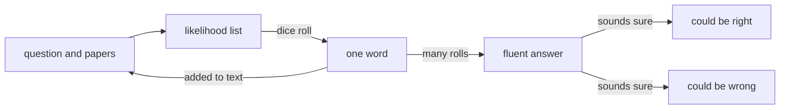

# Harness Engineering Notes

Oct 3, 2026 · @Subhadeep Majumder

# My sources
https://www.faros.ai/blog
https://github.com/walkinglabs/learn-harness-engineering
https://addyosmani.com/blog/good-spec/
https://www.augmentcode.com/blog
https://ven109.github.io/agent-harness-book-claude/
https://walkinglabs.github.io/learn-harness-engineering/en/
https://github.com/subhadlearner/my-learning-with-claude/tree/main/HarnessEngineering/Resources

## How these notes work

One nugget is added here every morning at about 7:15 am, from 4 October 2026 to 24 January 2027. Each one takes about five minutes to read.

The whole course builds one idea: a language model is a function that remembers nothing and whose output varies, and every part of a reliable harness is a consequence of those two facts. Each day adds one consequence to the days before it, so the notes are meant to be read in order.

Every nugget has the same shape: a scene with the builder, three to five small steps from basics, the idea stated only at the end, something to try yourself, where it lives in SubhForge, one question to check yourself, and one source. Each is 300 to 400 words.

If a topic cannot be taught this way, it is not forced. It is written up in `Parked Topics.md` with the reason and sources to read, and the nugget or block where it was skipped says so in a line starting "Parked".

The notes are yours to edit. Add your own remarks under any nugget; the morning run only appends at the end and does not rewrite what is already here.

## The arc to 24 January

Block 1 gives the reasons a harness must exist. Every later block takes one part and goes deeper, in dependency order from the model outward, so each block rests only on the ones before it. Each block runs Monday to Sunday and is planned automatically on the Sunday evening before it starts.

| Block | Dates | Sub-topic | The question it answers | Planned |
| --- | --- | --- | --- | --- |
| 1 | 4–21 Oct | Why a harness exists: the chain of consequences | why any of this is needed | Yes |
| – | 22–25 Oct | Review days on Block 1 | | Yes |
| 2 | 26 Oct–1 Nov | The loop in depth: turns, stop conditions, interrupts | how the model acts | Not yet |
| 3 | 2–8 Nov | Tools and actions: interface design, how many tools, file-editing strategies | what it acts with | Not yet |
| 4 | 9–15 Nov | Permissions and sandboxing: what an agent may run, and where | what it is allowed to do | Not yet |
| 5 | 16–22 Nov | Instructions and context: layering, precedence, what goes in front of the model | what it is told | Not yet |
| 6 | 23–29 Nov | Memory: compaction when the window fills, session memory, persistent memory | what it remembers | Not yet |
| 7 | 30 Nov–6 Dec | Task specification and decomposition: specs, dependencies, readiness | what it is asked to do | Not yet |
| 8 | 7–13 Dec | Verification and evidence: test tiers, independent checking, mechanical enforcement | how we know it is done | Not yet |
| 9 | 14–20 Dec | Change and reconciliation: impact analysis, where propagation stops, drift | what happens when things change | Not yet |
| 10 | 21–27 Dec | Failure, recovery and observability: traces, failure attribution, recording interventions | what happens when things break | Not yet |
| 11 | 28 Dec–3 Jan | Multi-agent orchestration: delegation, roles, responsibility | more than one builder | Not yet |
| 12 | 4–10 Jan | Cost, model routing and provider abstraction | what it costs | Not yet |
| 13 | 11–17 Jan | Extensibility: skills, hooks, plugins, MCP | how it grows | Not yet |
| 14 | 18–24 Jan | Judging and designing a harness: maturity levels, trace-based evaluation, anti-patterns; course capstone | the whole, judged | Not yet |

`course/coverage.md` shows how this plan was checked against your sources. To change a sub-topic, leave a remark in these notes before Sunday evening.

## Block 1: Why a harness exists (4–21 Oct)

Seventeen days, one chain. Each day asks one question and adds one link that follows from the ones before. The wrap-up is on 21 October.

1. Where does the model keep your project?
2. Why does the same question get different answers?
3. How does a text function get any work done?
4. Why do long tasks go wrong even with a good model?
5. If he forgets everything, where must the plan live?
6. What happens when two documents disagree?
7. Is "what we are building" the same kind of fact as "what is done"?
8. Why not hand him everything?
9. How big should one job be?
10. When he says "done", what do you have?
11. Who should the inspector be?
12. Is yesterday's inspection still good today?
13. Who decides?
14. What breaks when the plan changes?
15. What if he is interrupted halfway?
16. How do you find out what happened?
17. Can you rebuild the whole design from two facts?

The daily nuggets follow below, newest at the bottom.

### Day 1 · 4 Oct: Where does the model keep your project?

Imagine a master builder with forty years of skill and one strange condition: every morning he wakes with no memory of any site he has worked on. Hold that picture. Now let's see why it is exactly true of a model.

**Step 1. What is a model, physically?** A file of numbers on a disk. Training produced those numbers, and then training stopped. The file is frozen.
*The builder's skill: learned once, fixed.*

**Step 2. What happens when you use it?** A program reads your text, runs arithmetic through those numbers, and produces text. Then it stops. Compare the file before and after: identical, byte for byte. Using the model does not change it, the same way reading a book does not change the book.
*The builder works a full day and goes home. Nothing about the day is stored in him.*

**Step 3. So where could yesterday be?** There are only two places anything can live: in the file, or in the text you hand over. Step 2 rules out the file. So if something is not in the text you send right now, then for the model it does not exist.
*He knows only the papers put in his hands this morning.*

**Step 4. But chat remembers what I said.** Look at what the app sends. On your third message it sends the first message, the first reply, the second message, the second reply, and then your third. The whole transcript, every time. The memory is in the app.
*Someone hands him yesterday's site diary at the gate each morning.*

**Now it's obvious.** The model knows two things: the general skill frozen into it, and the text in front of it. Your project is never in the first, so it must always be put into the second, by something outside the model.

**See it yourself (2 minutes).** Open a new chat and ask: "What did we decide yesterday about error handling?" Then paste yesterday's decision and ask again.

**In SubhForge:** this is why your vision lists "lost context" and "repeated explanation" first among the things to minimise (Architecture §1).

**Chain so far:** remembers nothing

**Check yourself:** A coding agent "remembers" your coding conventions across sessions. What must be happening?

*Tomorrow:* ask him the same question on two mornings and you get two different answers. Why?

*Source:* [Google, "Agents" whitepaper](https://github.com/subhadlearner/my-learning-with-claude/blob/main/HarnessEngineering/Resources/22365_19_Agents_v8.pdf), p. 8, "Agents vs. models".

### Day 2 · 5 Oct: Why does the same question get different answers?

**Day 2: Why does the same question get different answers?**

*Yesterday:* Something outside the model saved your conventions as text and puts them back in front of it every session.

Monday: you ask the builder where the drain goes. "North wall," he says calmly. Tuesday, same question, same papers: "South wall," just as calmly. His skill has not changed. So where did the difference come from?

**Step 1. What does the arithmetic actually produce?** Not a word. It produces a score for every possible next piece of text (a "token", a few letters long): "north" 60%, "south" 30%, "east" 10%.
*His skill tells him which answers are likely, not which is right.*

**Step 2. So how does one word get chosen?** The program rolls a weighted dice over that list. "North" comes up most often, but "south" still comes up about one time in three.
*Each morning his pick has some chance in it.*

**Step 3. Why does one roll change the whole answer?** The chosen word is added to the text and the model runs again, now reading "south". Every later word builds on it, so one different early pick gives a different paragraph.
*Once he has said "south wall", he plans the pipes and trench to match.*

**Step 4. Does anything mark a bad roll?** No. The same arithmetic and dice made both answers; no step checks facts or softens the tone when unsure. A wrong answer is built exactly like a right one, so it reads just as sure.
*Both mornings sound equally certain: the certainty is in how he talks, not in what he knows.*

**Now it's obvious.** The same input can give different outputs, because each word is a weighted roll that shapes the next. And how confident the wording sounds tells you nothing about whether it is right.

**Picture.**

**See it yourself (2 minutes).** Ask the same design question, word for word, in two fresh chats, such as "Should retry logic live in the caller or the service?" Compare the answers and how sure each sounds.

**In SubhForge:** your cost rules already assume runs vary: "repeated semantically identical failures stop instead of burning budget" (Architecture §22).

**Chain so far:** remembers nothing → output varies

**Check yourself:** An agent writes "all tests pass" in a confident sentence. What does the confidence tell you?

*Tomorrow:* the builder only ever writes words on paper. So how does anything on the site get built?

*Source:* [Agentway Harness Books, book 1: Claude Code](https://github.com/subhadlearner/my-learning-with-claude/blob/main/HarnessEngineering/Resources/book1-claude-code-en.pdf), ch. 1 §1.5, p. 10: "External systems do not forgive bad execution just because model tone sounds confident."
